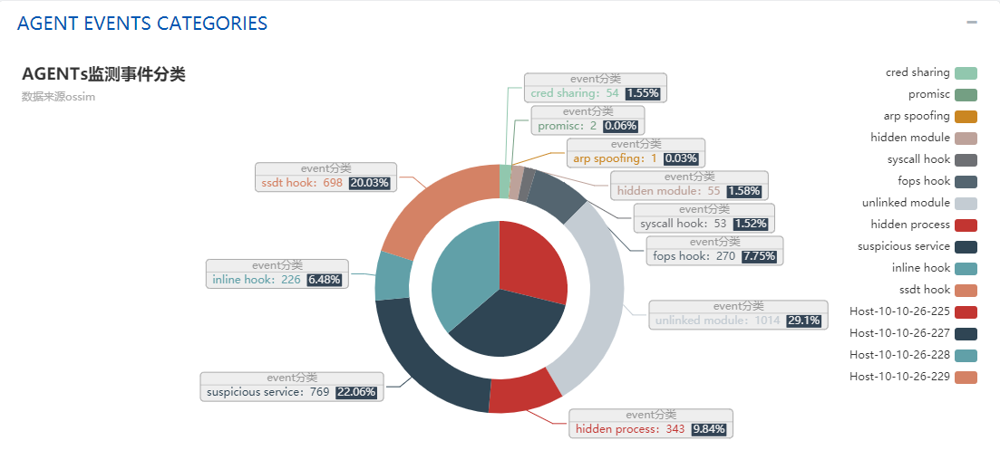

#    

## 🚀 项目简介

**DistributedNIDS-Framework** 是一个开源的分布式入侵检测系统 (IDS)，结合了强大的 [Snort](https://snort.org/) 入侵检测引擎和 [Apache Spark](https://spark.apache.org/) 的分布式数据处理能力。通过容器化部署，利用 [Docker](https://www.docker.com/) 和 [Nginx](https://www.nginx.com/) 实现高效的负载均衡和可扩展性，提供实时监控与报警功能，并配备直观的 Web 管理界面，帮助用户轻松管理和监控网络安全。

## 🔍 功能特性

- **分布式流量分析与入侵检测**：利用 Apache Spark 的分布式计算能力，实时处理和分析来自多个 Snort 节点的网络流量数据。
- **容器化部署**：通过 Docker 容器化各个组件，简化部署流程，确保环境一致性。
- **高效负载均衡**：使用 Nginx 作为反向代理，智能分配流量，保证 Web 服务的高可用性。
- **实时监控与报警**：实时检测网络威胁，并通过多种方式（如邮件、短信）发送报警通知。
- **可视化管理界面**：直观的 Web 界面，方便用户查看检测结果、管理规则和配置报警设置。
- **可扩展性强**：模块化设计，支持根据需求轻松扩展处理能力和功能。

## 🛠 技术栈

- **Snort**：入侵检测系统
- **Apache Spark**：分布式数据处理
- **Docker**：容器化部署
- **Nginx**：负载均衡
- **Flask**：后端 Web 服务
- **React**：前端管理界面

## 📷 截图

### 实时监控界面
)

## 📦 安装与部署

### 环境要求

- **操作系统**：Linux / macOS / Windows (Docker Desktop)
- **Docker**：>= 20.10
- **Docker Compose**：>= 1.29
- **硬件**：至少 8 核 CPU，16GB 内存

### 安装步骤

1. **克隆仓库**

    ```bash
    git clone https://github.com/yourusername/DistributedSnort-Framework.git
    cd DistributedSnort-Framework
    ```

2. **构建 Docker 镜像**

    ```bash
    docker-compose build
    ```

3. **启动所有服务**

    ```bash
    docker-compose up -d
    ```

4. **检查服务状态**

    ```bash
    docker-compose ps
    ```

5. **访问 Web 界面**

    打开浏览器，访问 [http://localhost:8080](http://localhost:8080)

### 配置说明

- **Snort 配置**：编辑 `docker/snort/snort.conf` 以配置 Snort 规则和参数。
- **Spark 配置**：编辑 `docker/spark/spark.conf` 以调整 Spark 集群设置。
- **Nginx 配置**：编辑 `docker/nginx/nginx.conf` 以设置负载均衡策略。
- **Web 服务器配置**：编辑 `src/web_server/app.py` 以配置后端服务参数。

### 常见问题

#### 无法启动 Snort 容器

- 检查 `snort.conf` 配置文件是否正确，确保规则文件路径正确。
- 查看 Snort 容器日志：

    ```bash
    docker logs snort
    ```

#### Spark 集群未响应

- 检查 Spark 容器日志，确保所有节点正常启动并互相通信。

    ```bash
    docker logs spark-master
    docker logs spark-worker
    ```

## 📝 使用指南

### 访问 Web 界面

在浏览器中打开 [http://localhost:8080](http://localhost:8080)，即可访问管理界面。

### 登录

默认用户名和密码：

- **用户名**: `admin`
- **密码**: `password`

**请登录后立即更改密码以确保安全。**

### 实时监控

在“实时监控”页面，您可以查看当前检测到的入侵尝试和网络流量统计。

### 管理规则

在“规则管理”页面，您可以添加、删除或修改 Snort 规则。

### 报警设置

在“报警设置”页面，配置报警通知方式，如邮件或短信。

### 查看日志

在“日志”页面，查看系统运行日志和历史检测记录。

## 📚 文档

- [架构设计](docs/architecture.md)
- [部署指南](docs/deployment.md)
- [使用指南](docs/usage.md)
- [API 文档](docs/api.md)

## 🧩 贡献

我们欢迎社区的贡献！请按照以下步骤进行：

1. Fork 本仓库
2. 创建您的分支 (`git checkout -b feature/新功能`)
3. 提交您的更改 (`git commit -m '添加新功能'`)
4. 推送到分支 (`git push origin feature/新功能`)
5. 创建一个 Pull Request

请参阅 [贡献指南](CONTRIBUTING.md) 了解更多信息。

## 🧪 测试

在提交 Pull Request 之前，请确保所有测试通过。查看 [测试文档](tests/) 了解更多。

## 📝 许可证

本项目采用 [MIT 许可证](LICENSE)

---

